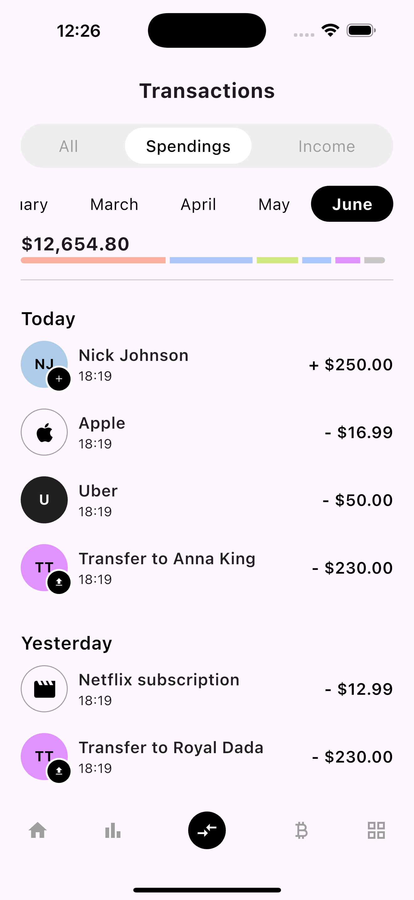

# 📱 Transactions History UI in Flutter

This project implements a sleek and responsive **Transactions History UI** in Flutter. It showcases a transaction overview screen with a balance chart, tabs for Spendings/Income, month selector, and a list of transaction tiles with icons, initials, and labels.

## 📸 Preview



## 📦 Features

- Transaction summary screen with total balance indicator
- Custom tab bar for **All**, **Spendings**, and **Income**
- Horizontal month selector with active month highlight
- Transaction groups divided by **Today**, **Yesterday**
- Transaction tiles showing:
    - Custom icons or initials (generated from name)
    - Amounts with color-coded styling
    - Optional secondary icons like transfer/upload symbols
- Bottom Navigation Bar with active highlighting

## 🛠️ Dependencies

- `flutter`
- `responsive_sizer` 📦 for responsive sizing based on screen dimensions

## 📂 Project Structure

```
lib/
 └── transactions_screen.dart
```

## 📲 How to Use

1. Clone the repository or copy the code.
2. Add `responsive_sizer` to your `pubspec.yaml`:
    ```yaml
    dependencies:
      responsive_sizer: ^3.1.0
    ```
3. Import the screen in your `main.dart`:
    ```dart
    import 'transactions_screen.dart';
    ```
4. Run your app:
    ```bash
    flutter run
    ```

## 📜 Notes

- Uses a helper function `getInitials` to generate initials from a transaction name.
- You can customize colors, icons, and month list as needed.
- Add your own transaction data integration or dummy data for testing.

## 📃 License

Free to use and modify for personal and commercial projects.

---

👨‍💻 Built with ❤️ in Flutter.
